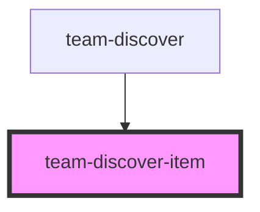

# team-discover-item

<!-- Auto Generated Below -->

## Properties

| Property | Attribute | Description | Type                                                             | Default     |
| -------- | --------- | ----------- | ---------------------------------------------------------------- | ----------- |
| `item`   | --        |             | `{ id: number; name: string; price: number; images: string[]; }` | `undefined` |

## Dependencies

### Used by

 - [team-discover](../team-discover)

### Graph

----------------------------------------------

*Built with [StencilJS](https://stenciljs.com/)*
